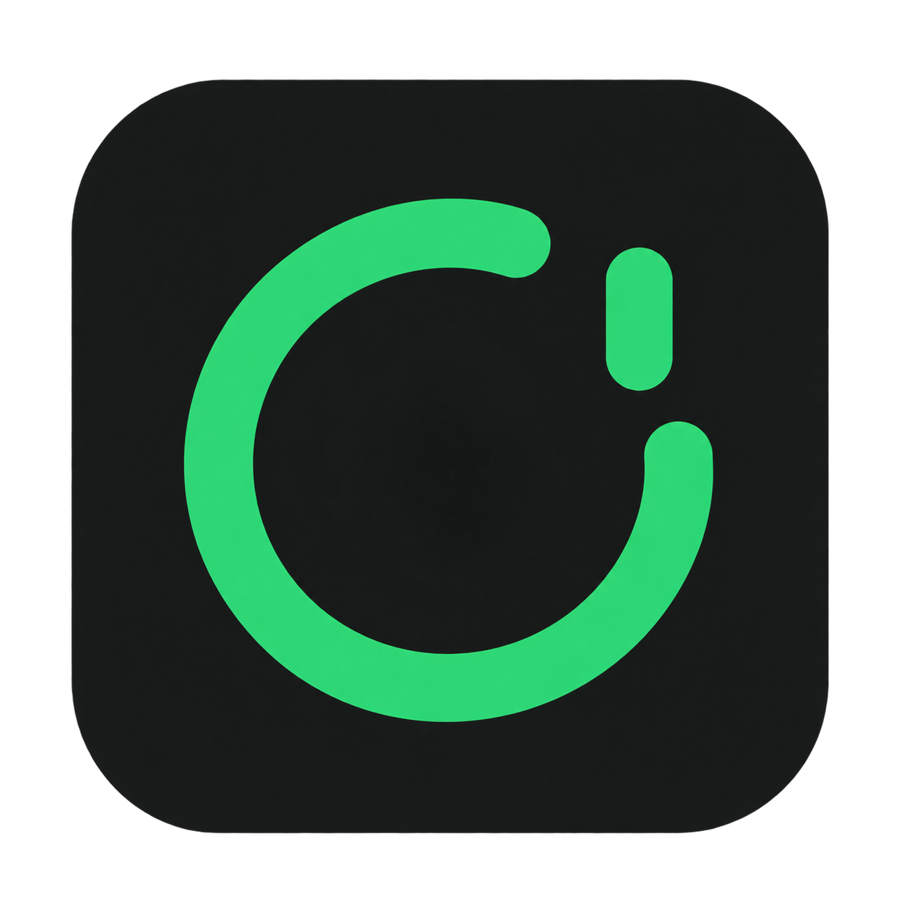

<p align="center">
  
</p>

# Codex Usage Rings

把 Codex 剩余额度放进 Mac 顶部菜单栏。一个账户一个彩色圆环，剩余百分比用纯数字显示在环内（省略 %），点击查看额度周期、重置时间和账户设置。

[下载 v0.4.3](https://github.com/yangbo-s/codex-usage-rings/releases/tag/v0.4.3) · [更新记录](docs/releases/v0.4.3.md) · [MIT License](LICENSE)

## 安装

当前预编译包适用于 **Apple Silicon（M 系列芯片）和 macOS 13 或更高版本**。使用安装包无需安装 Swift 或 Xcode。

1. 从 [Release](https://github.com/yangbo-s/codex-usage-rings/releases/tag/v0.4.3) 下载 `Codex-Usage-Rings-v0.4.3-macos-arm64.dmg`。
2. 双击 DMG，将里面的 `Codex Usage Rings.app` 拖到 `Applications` 文件夹入口。复制完成后推出磁盘映像，再从“应用程序”打开。
3. 先确保本机已安装 Codex CLI 或 Codex / ChatGPT 桌面应用，并使用 **ChatGPT 账户**登录。此工具复用本机 Codex 获取订阅用量；API Key 登录不提供这种额度。
4. 首次启动会尝试连接本机已有登录。成功后，菜单栏出现一个真实账户圆环；未连接时显示一个灰色入口，点击即可连接。

应用只在菜单栏运行，没有 Dock 图标。点击面板右下角电源图标即可直接退出；鼠标悬停时图标变红，也可使用 ⌘Q。

**当前是预览版，采用 ad-hoc 签名，尚未经过 Developer ID 签名与 Apple 公证。** 首次打开可能被 macOS 拦截。确认下载来源及校验值后，可按 [Apple 的说明](https://support.apple.com/zh-cn/102445)，在尝试打开应用后前往“系统设置 → 隐私与安全性 → 仍要打开”。

Release 同时提供 `SHA256SUMS.txt`。把它与下载的 DMG 放在同一个目录，然后执行：

```sh
shasum -a 256 --ignore-missing -c SHA256SUMS.txt
```

v0.4.3 使用 DMG 分发；旧版 v0.2.0 的 ZIP 保留在对应 Release。

## 圆环怎么看

| 元素 | 含义 |
| --- | --- |
| 彩色弧长和中心数字 | 剩余额度；中心数字对应外环的百分比，省略 % |
| 绿 / 蓝 / 黄 / 红 | 按显示整数：75–100 / 50–74 / 25–49 / 0–24；内外环分别取色 |
| 较厚单环 | 只有一个额度窗口，包括只有 5 小时额度的情况 |
| 外环 + 内环 | 同时有长周期与 5 小时额度：外环显示长周期，内环显示 5 小时 |
| 右侧绿色标记 | 1 次一根线，2 次两根线，3 次及以上为一根线＋竖向三点；与外环同宽，独立保持绿色；工具只读取，不兑换 |
| `—` | 当前额度未知，保留灰色；0% 则显示淡红色空轨道 |
| 灰色弧线和过期提示 | 同步失败时保留的上一次快照 |

每连接一个账户，菜单栏增加一个圆环。入口按内容收紧宽度，最多显示两列 reset 标记。悬停查看准确次数和简要用量；点击圆环即可查看额度窗口与 **Reset 到期时间**，每份 reset 独立一行：左侧加粗 **Full reset**，右侧如 **Expires October 29, 14:44**。日期按系统时区从早到晚排列，跨年时补充年份；同一到期时间也分行显示。无期限显示 No expiry，未知期限显示 Expiry unknown；明细不完整的差额单独汇总为未知。已到期显示 Expired，余额仍以服务端为准。应用没有演示模式。

账户套餐 `pro` 显示为 **Pro 200**，`prolite` / `promax` 分别显示为 Pro Lite / Pro Max。

## 多账户

进入 **圆环 → 账户与设置**：

- **连接本机 Codex**：读取现有本机登录，不更换账户、不登出、不发起模型推理。本机 Codex 换号后，这个入口跟随换号。
- **添加其他账户**：打开官方浏览器登录页，选择另一个账户。每个额外账户使用独立目录保存登录状态；等待超过 5 分钟可重新发起。
- **修改昵称 / 移除账户**：名称自动保存。移除只停止展示和查询，不删除凭据、不退出 Codex。移除最后一个账户后，下次启动不会自动重新添加。

本机账户与“添加其他账户”使用不同的登录目录；请在浏览器中确认选择的是期望连接的账户。

## 面板自动收起

在 **账户与设置 → 自动收起面板** 中调整：默认鼠标移出后 **3 秒**收起，可输入 **1–300 秒**，按 Return 或离开输入框提交，设置自动保存；关闭开关即可停用。移回面板会取消倒计时，编辑文字时暂停，结束编辑后重新计时。点击面板外部仍按 macOS 原生行为关闭。

顶栏圆环为 18pt，详情圆环为 36pt；环内只显示数字，100 按实际字形尽量放大并与环线保留间隙，详情和悬停提示仍保留百分比单位。浅色外观的黄色偏金黄，以保持细线可见。展开和收起使用系统过渡，遵循 macOS“减少动态效果”。仅鼠标离开可见面板时使用一次性计时器，无鼠标轮询和持续动画。

## 登录启动与省电

在“账户与设置”打开 **登录时启动**，下次登录 Mac 后会自动显示圆环。首次默认关闭，开关反映系统状态；需要系统批准时会给出入口。建议先把应用移入“应用程序”文件夹，再启用这个设置。

当前版本的刷新策略：

| 场景 | 行为 |
| --- | --- |
| 普通后台 | 每 5 分钟刷新 |
| 系统低电量模式 | 每 15 分钟刷新 |
| 打开面板 / 系统唤醒 | 按需更新，复用最近 60 秒的快照 |
| 点击“刷新用量” | 立即发起读取；已有刷新进行中时不重复发起 |
| 系统睡眠 | 停止计时器和自有查询进程 |
| 查询失败 | 逐步退避，重试间隔最高 60 分钟 |

定时器使用 20% 容差，允许系统合并唤醒，因此不承诺精确到秒。多个账户依次查询，读取完成即关闭 app-server；浏览器登录期间才临时保留相应进程，最长 5 分钟。没有持续动画或逐秒倒计时。

## 数据与凭据

用量通过本机 `codex app-server` 的 stdio JSON-RPC 获取。优先使用 `rateLimitsByLimitId.codex`，兼容 `rateLimits`；按实际 `windowDurationMins` 识别窗口。Banked reset 数量使用 `rateLimitResetCredits.availableCount`，不根据可能不完整的明细列表推算。到期时间取同一响应的 `credits[].expiresAt`，不会用额度窗口的重置时间代替，无额外网络请求。

应用自身不解析或打印登录令牌，不创建对话、不发起模型调用。数据保存在：

```text
~/Library/Application Support/Codex Usage Rings/
├── settings.json      # 账户元数据、首次自动连接标志与面板收起偏好
└── profiles/<id>/     # 由 Codex 维护的独立账户登录状态
```

独立账户使用隔离的 `CODEX_HOME` 和文件凭据存储；请把 `profiles` 及其备份视为敏感数据，不要提交到 Git。旧版演示记录会被过滤；设置损坏时保留原文件并显示错误，不静默覆盖。

## 常见问题

**打开后找不到窗口？** 这是菜单栏应用，请查看屏幕顶部右侧圆环。没有 Dock 图标是正常行为。

**提示找不到 Codex？** 安装 Codex CLI 或桌面应用后重启。默认搜索常见桌面应用和 Homebrew 路径；自定义位置可通过 `CODEX_CLI_PATH` 指定。

**已登录，但读不到额度？** 确认使用 ChatGPT 账户而非 API Key。登录过期时，先在 Codex 中重新登录；独立账户可重新添加。未知额度显示 `—`，同步失败会保留旧快照。

**自启动没有生效？** 打开面板查看是否显示“等待系统允许”，按提示到 macOS 登录项设置批准，并确认应用没有被移动或删除。

**是否支持 Intel Mac？** 当前预编译包只有 arm64，暂不提供 Intel 或 Universal 包。

## 从源码构建

需要 macOS、Swift 6 工具链及 Xcode Command Line Tools，无第三方包依赖。

```sh
git clone https://github.com/yangbo-s/codex-usage-rings.git
cd codex-usage-rings
swift test
bash scripts/build-app.sh
open "dist/Codex Usage Rings.app" --args --show
```

输出位于 `dist/Codex Usage Rings.app`，构建脚本会加入图标并进行 ad-hoc 签名。

开发用环境变量：

| 变量 | 用途 |
| --- | --- |
| `CODEX_CLI_PATH` | 自定义 Codex 可执行文件路径 |
| `USAGE_RINGS_DATA_DIR` | 重定向元数据及独立账户目录 |
| `USAGE_RINGS_SNAPSHOT_DIR` | 仅供渲染测试导出图像 |

环境变量应传入实际启动的进程；从 Finder 打开的应用不会自动继承终端里临时 `export` 的值。需要自定义路径时可在终端直接启动可执行文件，例如：

```sh
CODEX_CLI_PATH="/absolute/path/to/codex" \
  "dist/Codex Usage Rings.app/Contents/MacOS/CodexUsageRings" --show
```

只读接口探针（不打印邮箱或令牌）：

```sh
swift run CodexUsageRings --probe
```

把当前构建的应用打成带 Applications 拖拽入口的 DMG，并生成校验文件：

```sh
bash scripts/package-release.sh
```

修改图标源图后，运行 `bash scripts/build-icon.sh`，再重新构建。原始 PNG 和 macOS `.icns` 均保存在 [Resources](Resources)。Logo 由 AI 生成。

## 已知限制

当前为预览版，仅提供 Apple Silicon 安装包，尚未经过 Developer ID 签名与 Apple 公证，也不支持自动更新。多账户登录、系统登录启动、辅助功能及不同 macOS 版本的兼容性仍需完善；实际耗电随账户数量和使用情况变化。

参考：[Codex App Server](https://learn.chatgpt.com/docs/app-server)、[认证与凭据存储](https://learn.chatgpt.com/docs/auth)、[SMAppService](https://developer.apple.com/documentation/servicemanagement/smappservice)。

## 许可证

本项目采用 [MIT License](LICENSE)，允许使用、修改、分发和商用；分发时须保留版权与许可声明。
